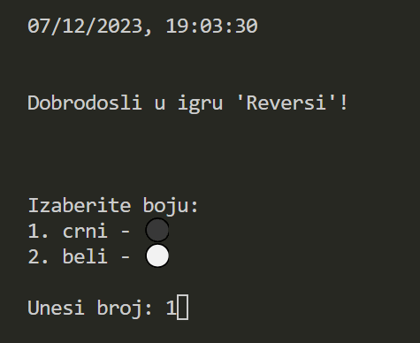
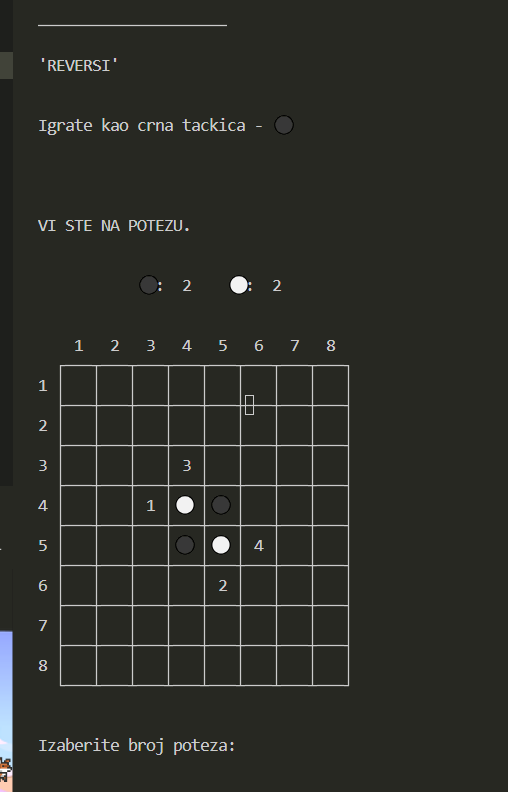
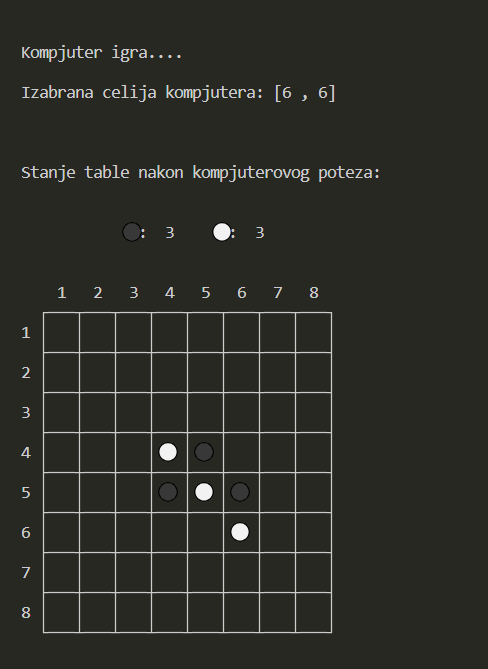

# Tamara Cvjetkovic

Reversi (Othello)

# Name of the project
Reversi (Othello): the classic game Reversi (Othello)

# INFORMATIONS ABOUT THE STUDENT
- NAME: Tamara Cvjetković
- STUDENT INDEX: sv48-2022
- FACULTY: Faculty of Technical Science, Novi Sad
- STUDIES: Software Engineering and Information Technologies 
- ACADEMIC DEGREE: Bachelor with Honours in Software Engineering

- CONTACT: c.tamara02@gmail.com || cvjetkovic.sv48.2022@uns.ac.rs
- PHONE: +381 65 4468 114 (Serbia) || +387 66 868 639 (BiH)

# Project description
Project from subject named "Algorithms and Data Structures"
FTN SIIT, 2nd semester, Novi Sad, 2023.

A console application in Python for the classic game Reversi (Othello), featuring player-versus-computer functionality. The implementation includes the Mini-Max algorithm with a heuristic function for intelligent decision-making by the computer opponent.

# For the development of the application, the following tools were utilized:
- Python

# Functionalities:
After choosing your color, you play versus the computer by selecting the number of the cell where you want to put your piece/disk. The color does not change who goes first, but is only an implemented detail. The player always plays first.

* NOTE: since this is a console application and it prints symbols, the visual design will vary depending on which OS you run it on. The project was done in Visual Studio Code on Windows, so the table looks clean, if you run it from there, but it will probably break on any other OS.

# How to start the application:
After downloading all files, you can open the project in Python IDE and run "reversi.py".

# How to use
You choose black or white color and start playing. You choose one of the free cells which you want by typing in one of given numbers on the table.

# Visual design:

